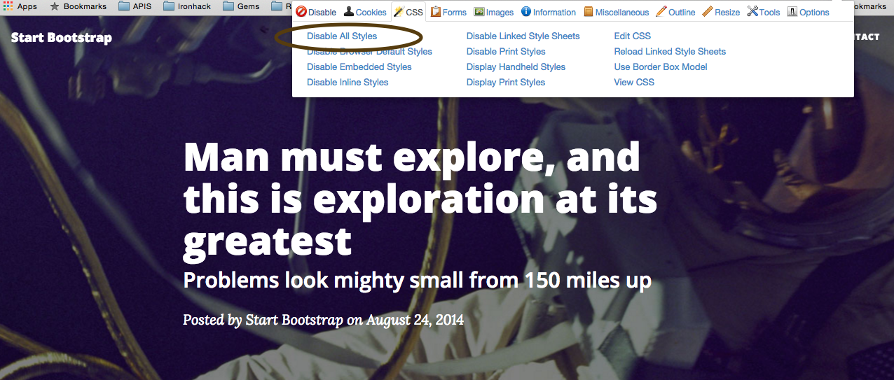
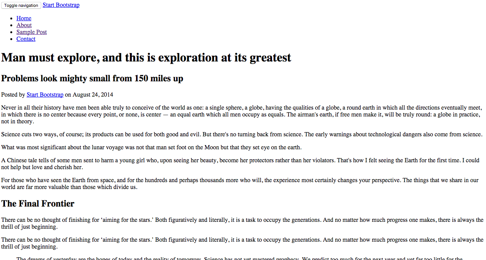

#Let's make a fancy blog

Everybody blogs. We need a template for our sweet new blog, but we don't want to just copy and paste some HTML, right? RIGHT? So let's recreate a cool blog template.

We'll be using this one here: http://ironsummitmedia.github.io/startbootstrap-clean-blog/post.html.


Looks pretty nifty with all of that fancy CSS, huh? Well, we're going to have to change that seeing as we don't know that much CSS. How can we go about doing that? Luckily chrome has a cool plugin called the web developer plugin.

You can find that [here](https://chrome.google.com/webstore/detail/web-developer/bfbameneiokkgbdmiekhjnmfkcnldhhm?hl=en-US). How do I use this plugin you might say? Well, like this: 



**turns into...**



It's your job to copy the layout as closely as you can, using the best HTML tags possible. You're going to need to look into the ```article```, ```p```, heading, ```img```, and ```a``` tags at the very least to get this working.

For the daring, feel free to look at the original version and play with the CSS and see what you can do.
